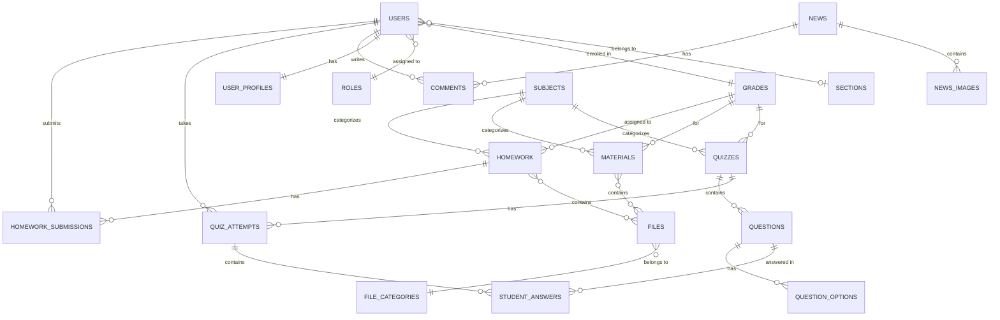

# Al-Manakhir Basic School - Database Design Document

**Project**: School Educational Platform (مدرسة المناخر الأساسية)  
**Version**: 1.0  
**Date**: February 12, 2026  
**Status**: Design Phase (Currently using Mock Data)

---

## Table of Contents

1. [Executive Summary](#executive-summary)
2. [Database Architecture Overview](#database-architecture-overview)
3. [Entity-Relationship Diagram](#entity-relationship-diagram)
4. [Database Schema Design](#database-schema-design)
5. [Data Dictionary](#data-dictionary)
6. [Indexing Strategy](#indexing-strategy)
7. [Security & Access Control](#security--access-control)
8. [Data Migration Strategy](#data-migration-strategy)
9. [Backup & Recovery Plan](#backup--recovery-plan)
10. [Scalability Considerations](#scalability-considerations)
11. [Technology Recommendations](#technology-recommendations)

---

## 1. Executive Summary

### 1.1 Current State

The Al-Manakhir Basic School platform currently operates with:

- **Mock Data**: JSON files stored in `/src/data/` directory
- **Client-Side Storage**: localforage (IndexedDB) for user submissions and interactions
- **No Backend**: All data processing happens client-side
- **Static Deployment**: GitHub Pages hosting

### 1.2 Future State (Production Database)

This document outlines a comprehensive relational database design to support:

- Multi-user authentication and authorization (Students, Teachers, Admins)
- Real-time content management and updates
- Persistent storage of submissions, grades, and feedback
- Analytics and reporting capabilities
- File upload and management
- Multi-language content support (Arabic/English)

### 1.3 Database Purpose

The database will serve as the central data repository for:

- **Academic Content**: Homework, materials, quizzes, exams
- **User Management**: Student profiles, teacher accounts, admin users
- **Interactions**: Submissions, quiz attempts, comments, ratings
- **School Information**: News, announcements, vision/mission statements
- **File Management**: Document uploads, images, multimedia content

---

## 2. Database Architecture Overview

### 2.1 Database Type

**Relational Database Management System (RDBMS)**

**Rationale**:

- Structured data with clear relationships
- ACID compliance required (Atomicity, Consistency, Isolation, Durability)
- Complex queries with joins across multiple entities
- Data integrity through foreign key constraints
- Strong consistency requirements for grades and submissions

### 2.2 Architecture Pattern

**Three-Tier Architecture**:

```bash
┌─────────────────────────────────────┐
│     Presentation Layer              │
│  (React Frontend - Vite + MUI)      │
└──────────────┬──────────────────────┘
               │ HTTP/REST API
┌──────────────▼──────────────────────┐
│     Application Layer               │
│  (Node.js/Express or ASP.NET Core)  │
│  - Authentication & Authorization   │
│  - Business Logic                   │
│  - API Endpoints                    │
│  - File Upload Handling             │
└──────────────┬──────────────────────┘
               │ SQL Queries
┌──────────────▼──────────────────────┐
│     Data Layer                      │
│  (PostgreSQL / MySQL / SQL Server)  │
│  - Relational Database              │
│  - Stored Procedures                │
│  - Triggers & Constraints           │
└─────────────────────────────────────┘
```

### 2.3 Core Design Principles

1. **Normalization**: Database normalized to 3NF to eliminate redundancy
2. **Referential Integrity**: Foreign keys enforce relationships
3. **Multi-Language Support**: Bilingual fields (Arabic/English) stored as JSON or separate columns
4. **Soft Deletes**: Use `deleted_at` timestamp instead of hard deletes
5. **Audit Trail**: Track creation and modification timestamps
6. **UUID Primary Keys**: For better security and distributed systems compatibility
7. **Indexes**: Strategic indexing on frequently queried columns

---

## 3. Entity-Relationship Diagram

### 3.1 High-Level ER Diagram



### 3.2 Entity Descriptions

| Entity | Description | Cardinality |
|--------|-------------|-------------|
| **USERS** | All system users (students, teachers, admins) | 1:N with most entities |
| **USER_PROFILES** | Extended user information | 1:1 with USERS |
| **ROLES** | User roles/permissions | N:M with USERS |
| **GRADES** | Academic grade levels (KG, 1-11, Tawjihi) | 1:N with USERS, HOMEWORK, etc. |
| **SECTIONS** | Class sections (A, B, C, D) | 1:N with USERS |
| **SUBJECTS** | Academic subjects | 1:N with content entities |
| **HOMEWORK** | Homework assignments | N:M with USERS via SUBMISSIONS |
| **HOMEWORK_SUBMISSIONS** | Student homework submissions | N:1 with USERS, HOMEWORK |
| **MATERIALS** | Educational materials/resources | N:N with FILES |
| **QUIZZES** | Online quizzes/exams | 1:N with QUESTIONS |
| **QUESTIONS** | Quiz questions | 1:N with QUESTION_OPTIONS |
| **QUIZ_ATTEMPTS** | Student quiz attempts | N:1 with USERS, QUIZZES |
| **STUDENT_ANSWERS** | Answers to quiz questions | N:1 with QUIZ_ATTEMPTS |
| **NEWS** | School news and announcements | 1:N with COMMENTS |
| **COMMENTS** | User comments on news | N:1 with USERS, NEWS |
| **FILES** | Uploaded files/attachments | N:M with various entities |

---

## 4. Database Schema Design

### 4.1 Users & Authentication

#### Table: `users`

Primary entity for all system users.

```sql
CREATE TABLE users (
    id UUID PRIMARY KEY DEFAULT gen_random_uuid(),
    username VARCHAR(50) UNIQUE NOT NULL,
    email VARCHAR(255) UNIQUE NOT NULL,
    password_hash VARCHAR(255) NOT NULL,
    role_id INTEGER NOT NULL,
    is_active BOOLEAN DEFAULT true,
    is_verified BOOLEAN DEFAULT false,
    email_verified_at TIMESTAMP,
    last_login_at TIMESTAMP,
    created_at TIMESTAMP DEFAULT CURRENT_TIMESTAMP,
    updated_at TIMESTAMP DEFAULT CURRENT_TIMESTAMP,
    deleted_at TIMESTAMP,
    
    CONSTRAINT fk_users_role FOREIGN KEY (role_id) 
        REFERENCES roles(id) ON DELETE RESTRICT
);

CREATE INDEX idx_users_email ON users(email);
CREATE INDEX idx_users_username ON users(username);
CREATE INDEX idx_users_role ON users(role_id);
CREATE INDEX idx_users_active ON users(is_active) WHERE deleted_at IS NULL;
```

**Fields Description**:

- `id`: UUID primary key for user identification
- `username`: Unique username for login (alphanumeric)
- `email`: User's email address (must be unique)
- `password_hash`: Bcrypt/Argon2 hashed password
- `role_id`: Foreign key to roles table (student/teacher/admin)
- `is_active`: Flag to enable/disable user account
- `is_verified`: Email verification status
- `email_verified_at`: Timestamp of email verification
- `last_login_at`: Last successful login timestamp
- `created_at`, `updated_at`, `deleted_at`: Audit timestamps

---

#### Table: `roles`

User role definitions for RBAC (Role-Based Access Control).

```sql
CREATE TABLE roles (
    id SERIAL PRIMARY KEY,
    name VARCHAR(50) UNIQUE NOT NULL,
    name_ar VARCHAR(50) NOT NULL,
    name_en VARCHAR(50) NOT NULL,
    description TEXT,
    permissions JSONB,
    created_at TIMESTAMP DEFAULT CURRENT_TIMESTAMP,
    updated_at TIMESTAMP DEFAULT CURRENT_TIMESTAMP
);

-- Default roles
INSERT INTO roles (name, name_ar, name_en, description, permissions) VALUES
('student', 'طالب', 'Student', 'Student access level', '{"read": true, "submit": true}'),
('teacher', 'معلم', 'Teacher', 'Teacher access level', '{"read": true, "write": true, "grade": true}'),
('admin', 'مدير', 'Administrator', 'Full system access', '{"read": true, "write": true, "delete": true, "manage_users": true}');
```

---

#### Table: `user_profiles`

Extended user information (1:1 relationship with users).

```sql
CREATE TABLE user_profiles (
    id UUID PRIMARY KEY DEFAULT gen_random_uuid(),
    user_id UUID UNIQUE NOT NULL,
    first_name VARCHAR(100) NOT NULL,
    last_name VARCHAR(100) NOT NULL,
    first_name_ar VARCHAR(100),
    last_name_ar VARCHAR(100),
    date_of_birth DATE,
    gender VARCHAR(10),
    phone VARCHAR(20),
    parent_phone VARCHAR(20),
    address TEXT,
    profile_picture_url VARCHAR(500),
    national_id VARCHAR(50),
    enrollment_date DATE,
    graduation_date DATE,
    created_at TIMESTAMP DEFAULT CURRENT_TIMESTAMP,
    updated_at TIMESTAMP DEFAULT CURRENT_TIMESTAMP,
    
    CONSTRAINT fk_profiles_user FOREIGN KEY (user_id) 
        REFERENCES users(id) ON DELETE CASCADE
);

CREATE INDEX idx_profiles_user ON user_profiles(user_id);
CREATE INDEX idx_profiles_name ON user_profiles(first_name, last_name);
```

---

#### Table: `user_grade_sections`

Maps users to grades and sections (for students).

```sql
CREATE TABLE user_grade_sections (
    id SERIAL PRIMARY KEY,
    user_id UUID NOT NULL,
    grade_id INTEGER NOT NULL,
    section_id INTEGER,
    academic_year VARCHAR(9) NOT NULL, -- e.g., "2026-2027"
    is_current BOOLEAN DEFAULT true,
    enrolled_at TIMESTAMP DEFAULT CURRENT_TIMESTAMP,
    
    CONSTRAINT fk_ugs_user FOREIGN KEY (user_id) 
        REFERENCES users(id) ON DELETE CASCADE,
    CONSTRAINT fk_ugs_grade FOREIGN KEY (grade_id) 
        REFERENCES grades(id) ON DELETE RESTRICT,
    CONSTRAINT fk_ugs_section FOREIGN KEY (section_id) 
        REFERENCES sections(id) ON DELETE SET NULL,
    CONSTRAINT unique_user_grade_year UNIQUE (user_id, grade_id, academic_year)
);

CREATE INDEX idx_ugs_user ON user_grade_sections(user_id);
CREATE INDEX idx_ugs_grade ON user_grade_sections(grade_id);
CREATE INDEX idx_ugs_current ON user_grade_sections(is_current) WHERE is_current = true;
```

---

### 4.2 Academic Structure

#### Table: `grades`

Academic grade levels.

```sql
CREATE TABLE grades (
    id SERIAL PRIMARY KEY,
    code VARCHAR(20) UNIQUE NOT NULL, -- 'KG', '1', '2', ..., '11', 'Tawjihi'
    name_ar VARCHAR(100) NOT NULL,
    name_en VARCHAR(100) NOT NULL,
    display_order INTEGER NOT NULL,
    is_active BOOLEAN DEFAULT true,
    created_at TIMESTAMP DEFAULT CURRENT_TIMESTAMP,
    updated_at TIMESTAMP DEFAULT CURRENT_TIMESTAMP
);

-- Sample data
INSERT INTO grades (code, name_ar, name_en, display_order) VALUES
('KG', 'روضة', 'Kindergarten', 1),
('1', 'الصف الأول', 'Grade 1', 2),
('2', 'الصف الثاني', 'Grade 2', 3),
('3', 'الصف الثالث', 'Grade 3', 4),
('4', 'الصف الرابع', 'Grade 4', 5),
('5', 'الصف الخامس', 'Grade 5', 6),
('6', 'الصف السادس', 'Grade 6', 7),
('7', 'الصف السابع', 'Grade 7', 8),
('8', 'الصف الثامن', 'Grade 8', 9),
('9', 'الصف التاسع', 'Grade 9', 10),
('10', 'الصف العاشر', 'Grade 10', 11),
('11', 'الصف الحادي عشر', 'Grade 11', 12),
('Tawjihi', 'التوجيهي', 'Tawjihi', 13);
```

---

#### Table: `sections`

Class sections within each grade.

```sql
CREATE TABLE sections (
    id SERIAL PRIMARY KEY,
    name VARCHAR(10) NOT NULL, -- 'أ', 'ب', 'ج', 'د' (A, B, C, D)
    name_en VARCHAR(10) NOT NULL,
    grade_id INTEGER NOT NULL,
    teacher_id UUID,
    max_students INTEGER DEFAULT 30,
    is_active BOOLEAN DEFAULT true,
    created_at TIMESTAMP DEFAULT CURRENT_TIMESTAMP,
    updated_at TIMESTAMP DEFAULT CURRENT_TIMESTAMP,
    
    CONSTRAINT fk_sections_grade FOREIGN KEY (grade_id) 
        REFERENCES grades(id) ON DELETE CASCADE,
    CONSTRAINT fk_sections_teacher FOREIGN KEY (teacher_id) 
        REFERENCES users(id) ON DELETE SET NULL,
    CONSTRAINT unique_grade_section UNIQUE (grade_id, name)
);

CREATE INDEX idx_sections_grade ON sections(grade_id);
CREATE INDEX idx_sections_teacher ON sections(teacher_id);
```

---

#### Table: `subjects`

Academic subjects/courses.

```sql
CREATE TABLE subjects (
    id SERIAL PRIMARY KEY,
    code VARCHAR(20) UNIQUE NOT NULL,
    name_ar VARCHAR(100) NOT NULL,
    name_en VARCHAR(100) NOT NULL,
    description_ar TEXT,
    description_en TEXT,
    icon VARCHAR(100), -- Icon name or emoji
    color VARCHAR(7), -- Hex color code
    is_active BOOLEAN DEFAULT true,
    created_at TIMESTAMP DEFAULT CURRENT_TIMESTAMP,
    updated_at TIMESTAMP DEFAULT CURRENT_TIMESTAMP
);

-- Sample subjects
INSERT INTO subjects (code, name_ar, name_en, icon, color) VALUES
('MATH', 'رياضيات', 'Mathematics', '📐', '#2196F3'),
('SCI', 'علوم', 'Science', '🔬', '#4CAF50'),
('ARAB', 'لغة عربية', 'Arabic Language', '📖', '#FF5722'),
('ENG', 'لغة إنجليزية', 'English Language', '🇬🇧', '#9C27B0'),
('ARTS', 'فنون', 'Arts', '🎨', '#FF9800'),
('PE', 'رياضة', 'Physical Education', '⚽', '#00BCD4'),
('RELIG', 'تربية إسلامية', 'Islamic Education', '☪️', '#009688'),
('SOCIAL', 'اجتماعيات', 'Social Studies', '🌍', '#795548');
```

---

### 4.3 Homework & Assignments

#### Table: `homework`

Homework assignments.

```sql
CREATE TABLE homework (
    id UUID PRIMARY KEY DEFAULT gen_random_uuid(),
    title_ar VARCHAR(255) NOT NULL,
    title_en VARCHAR(255) NOT NULL,
    content_ar TEXT,
    content_en TEXT,
    subject_id INTEGER NOT NULL,
    grade_id INTEGER NOT NULL,
    section_id INTEGER, -- NULL means all sections
    teacher_id UUID NOT NULL,
    due_date TIMESTAMP NOT NULL,
    allow_file_submission BOOLEAN DEFAULT true,
    allow_text_submission BOOLEAN DEFAULT true,
    max_file_size_mb INTEGER DEFAULT 10,
    allowed_file_types VARCHAR(255), -- e.g., "pdf,docx,jpg,png"
    points INTEGER DEFAULT 0,
    is_published BOOLEAN DEFAULT false,
    created_at TIMESTAMP DEFAULT CURRENT_TIMESTAMP,
    updated_at TIMESTAMP DEFAULT CURRENT_TIMESTAMP,
    deleted_at TIMESTAMP,
    
    CONSTRAINT fk_homework_subject FOREIGN KEY (subject_id) 
        REFERENCES subjects(id) ON DELETE RESTRICT,
    CONSTRAINT fk_homework_grade FOREIGN KEY (grade_id) 
        REFERENCES grades(id) ON DELETE RESTRICT,
    CONSTRAINT fk_homework_section FOREIGN KEY (section_id) 
        REFERENCES sections(id) ON DELETE SET NULL,
    CONSTRAINT fk_homework_teacher FOREIGN KEY (teacher_id) 
        REFERENCES users(id) ON DELETE RESTRICT
);

CREATE INDEX idx_homework_grade ON homework(grade_id);
CREATE INDEX idx_homework_subject ON homework(subject_id);
CREATE INDEX idx_homework_due_date ON homework(due_date);
CREATE INDEX idx_homework_teacher ON homework(teacher_id);
CREATE INDEX idx_homework_published ON homework(is_published) WHERE deleted_at IS NULL;
```

---

#### Table: `homework_submissions`

Student homework submissions.

```sql
CREATE TABLE homework_submissions (
    id UUID PRIMARY KEY DEFAULT gen_random_uuid(),
    homework_id UUID NOT NULL,
    student_id UUID NOT NULL,
    submission_text TEXT,
    status VARCHAR(20) DEFAULT 'draft', -- draft, submitted, graded, late
    score DECIMAL(5,2),
    max_score DECIMAL(5,2),
    stars INTEGER CHECK (stars >= 0 AND stars <= 5),
    feedback_text TEXT,
    teacher_id UUID,
    submitted_at TIMESTAMP,
    graded_at TIMESTAMP,
    is_late BOOLEAN DEFAULT false,
    created_at TIMESTAMP DEFAULT CURRENT_TIMESTAMP,
    updated_at TIMESTAMP DEFAULT CURRENT_TIMESTAMP,
    
    CONSTRAINT fk_submissions_homework FOREIGN KEY (homework_id) 
        REFERENCES homework(id) ON DELETE CASCADE,
    CONSTRAINT fk_submissions_student FOREIGN KEY (student_id) 
        REFERENCES users(id) ON DELETE CASCADE,
    CONSTRAINT fk_submissions_teacher FOREIGN KEY (teacher_id) 
        REFERENCES users(id) ON DELETE SET NULL,
    CONSTRAINT unique_student_homework UNIQUE (homework_id, student_id)
);

CREATE INDEX idx_submissions_homework ON homework_submissions(homework_id);
CREATE INDEX idx_submissions_student ON homework_submissions(student_id);
CREATE INDEX idx_submissions_status ON homework_submissions(status);
CREATE INDEX idx_submissions_submitted ON homework_submissions(submitted_at);
```

---

#### Table: `submission_files`

Files attached to homework submissions.

```sql
CREATE TABLE submission_files (
    id UUID PRIMARY KEY DEFAULT gen_random_uuid(),
    submission_id UUID NOT NULL,
    file_id UUID NOT NULL,
    uploaded_at TIMESTAMP DEFAULT CURRENT_TIMESTAMP,
    
    CONSTRAINT fk_subfiles_submission FOREIGN KEY (submission_id) 
        REFERENCES homework_submissions(id) ON DELETE CASCADE,
    CONSTRAINT fk_subfiles_file FOREIGN KEY (file_id) 
        REFERENCES files(id) ON DELETE CASCADE
);

CREATE INDEX idx_subfiles_submission ON submission_files(submission_id);
```

---

### 4.4 Materials & Resources

#### Table: `materials`

Educational materials and resources.

```sql
CREATE TABLE materials (
    id UUID PRIMARY KEY DEFAULT gen_random_uuid(),
    title_ar VARCHAR(255) NOT NULL,
    title_en VARCHAR(255) NOT NULL,
    content_ar TEXT,
    content_en TEXT,
    description_ar TEXT,
    description_en TEXT,
    subject_id INTEGER NOT NULL,
    grade_id INTEGER NOT NULL,
    teacher_id UUID NOT NULL,
    file_type VARCHAR(50), -- pdf, docx, pptx, video, link
    file_url VARCHAR(500),
    file_size_kb INTEGER,
    download_count INTEGER DEFAULT 0,
    view_count INTEGER DEFAULT 0,
    is_published BOOLEAN DEFAULT false,
    upload_date TIMESTAMP DEFAULT CURRENT_TIMESTAMP,
    created_at TIMESTAMP DEFAULT CURRENT_TIMESTAMP,
    updated_at TIMESTAMP DEFAULT CURRENT_TIMESTAMP,
    deleted_at TIMESTAMP,
    
    CONSTRAINT fk_materials_subject FOREIGN KEY (subject_id) 
        REFERENCES subjects(id) ON DELETE RESTRICT,
    CONSTRAINT fk_materials_grade FOREIGN KEY (grade_id) 
        REFERENCES grades(id) ON DELETE RESTRICT,
    CONSTRAINT fk_materials_teacher FOREIGN KEY (teacher_id) 
        REFERENCES users(id) ON DELETE RESTRICT
);

CREATE INDEX idx_materials_grade ON materials(grade_id);
CREATE INDEX idx_materials_subject ON materials(subject_id);
CREATE INDEX idx_materials_teacher ON materials(teacher_id);
CREATE INDEX idx_materials_published ON materials(is_published) WHERE deleted_at IS NULL;
```

---

### 4.5 Quizzes & Exams

#### Table: `quizzes`

Online quizzes and exams.

```sql
CREATE TABLE quizzes (
    id UUID PRIMARY KEY DEFAULT gen_random_uuid(),
    title_ar VARCHAR(255) NOT NULL,
    title_en VARCHAR(255) NOT NULL,
    description_ar TEXT,
    description_en TEXT,
    subject_id INTEGER NOT NULL,
    grade_id INTEGER NOT NULL,
    teacher_id UUID NOT NULL,
    quiz_date DATE,
    start_time TIMESTAMP,
    end_time TIMESTAMP,
    duration_minutes INTEGER NOT NULL,
    total_points INTEGER DEFAULT 0,
    passing_score DECIMAL(5,2),
    max_attempts INTEGER DEFAULT 1,
    shuffle_questions BOOLEAN DEFAULT false,
    show_correct_answers BOOLEAN DEFAULT false,
    is_published BOOLEAN DEFAULT false,
    created_at TIMESTAMP DEFAULT CURRENT_TIMESTAMP,
    updated_at TIMESTAMP DEFAULT CURRENT_TIMESTAMP,
    deleted_at TIMESTAMP,
    
    CONSTRAINT fk_quizzes_subject FOREIGN KEY (subject_id) 
        REFERENCES subjects(id) ON DELETE RESTRICT,
    CONSTRAINT fk_quizzes_grade FOREIGN KEY (grade_id) 
        REFERENCES grades(id) ON DELETE RESTRICT,
    CONSTRAINT fk_quizzes_teacher FOREIGN KEY (teacher_id) 
        REFERENCES users(id) ON DELETE RESTRICT
);

CREATE INDEX idx_quizzes_grade ON quizzes(grade_id);
CREATE INDEX idx_quizzes_subject ON quizzes(subject_id);
CREATE INDEX idx_quizzes_date ON quizzes(quiz_date);
CREATE INDEX idx_quizzes_published ON quizzes(is_published) WHERE deleted_at IS NULL;
```

---

#### Table: `questions`

Quiz questions.

```sql
CREATE TABLE questions (
    id UUID PRIMARY KEY DEFAULT gen_random_uuid(),
    quiz_id UUID NOT NULL,
    question_text_ar TEXT NOT NULL,
    question_text_en TEXT NOT NULL,
    question_type VARCHAR(50) DEFAULT 'multiple_choice', -- multiple_choice, true_false, short_answer
    points INTEGER DEFAULT 1,
    display_order INTEGER,
    image_url VARCHAR(500),
    correct_answer_index INTEGER, -- For multiple choice (0-based)
    correct_answer_text TEXT, -- For short answer
    explanation_ar TEXT,
    explanation_en TEXT,
    created_at TIMESTAMP DEFAULT CURRENT_TIMESTAMP,
    updated_at TIMESTAMP DEFAULT CURRENT_TIMESTAMP,
    
    CONSTRAINT fk_questions_quiz FOREIGN KEY (quiz_id) 
        REFERENCES quizzes(id) ON DELETE CASCADE
);

CREATE INDEX idx_questions_quiz ON questions(quiz_id);
CREATE INDEX idx_questions_order ON questions(quiz_id, display_order);
```

---

#### Table: `question_options`

Multiple choice options for questions.

```sql
CREATE TABLE question_options (
    id UUID PRIMARY KEY DEFAULT gen_random_uuid(),
    question_id UUID NOT NULL,
    option_text_ar VARCHAR(500) NOT NULL,
    option_text_en VARCHAR(500) NOT NULL,
    option_order INTEGER NOT NULL,
    created_at TIMESTAMP DEFAULT CURRENT_TIMESTAMP,
    
    CONSTRAINT fk_options_question FOREIGN KEY (question_id) 
        REFERENCES questions(id) ON DELETE CASCADE
);

CREATE INDEX idx_options_question ON question_options(question_id);
```

---

#### Table: `quiz_attempts`

Student quiz attempts.

```sql
CREATE TABLE quiz_attempts (
    id UUID PRIMARY KEY DEFAULT gen_random_uuid(),
    quiz_id UUID NOT NULL,
    student_id UUID NOT NULL,
    attempt_number INTEGER NOT NULL,
    score DECIMAL(5,2),
    percentage DECIMAL(5,2),
    total_questions INTEGER,
    correct_answers INTEGER,
    status VARCHAR(20) DEFAULT 'in_progress', -- in_progress, submitted, graded
    started_at TIMESTAMP DEFAULT CURRENT_TIMESTAMP,
    submitted_at TIMESTAMP,
    time_taken_seconds INTEGER,
    created_at TIMESTAMP DEFAULT CURRENT_TIMESTAMP,
    updated_at TIMESTAMP DEFAULT CURRENT_TIMESTAMP,
    
    CONSTRAINT fk_attempts_quiz FOREIGN KEY (quiz_id) 
        REFERENCES quizzes(id) ON DELETE CASCADE,
    CONSTRAINT fk_attempts_student FOREIGN KEY (student_id) 
        REFERENCES users(id) ON DELETE CASCADE,
    CONSTRAINT unique_quiz_student_attempt UNIQUE (quiz_id, student_id, attempt_number)
);

CREATE INDEX idx_attempts_quiz ON quiz_attempts(quiz_id);
CREATE INDEX idx_attempts_student ON quiz_attempts(student_id);
CREATE INDEX idx_attempts_status ON quiz_attempts(status);
```

---

#### Table: `student_answers`

Individual answers to quiz questions.

```sql
CREATE TABLE student_answers (
    id UUID PRIMARY KEY DEFAULT gen_random_uuid(),
    attempt_id UUID NOT NULL,
    question_id UUID NOT NULL,
    selected_option_index INTEGER, -- For multiple choice
    answer_text TEXT, -- For short answer
    is_correct BOOLEAN,
    points_earned DECIMAL(5,2),
    answered_at TIMESTAMP DEFAULT CURRENT_TIMESTAMP,
    
    CONSTRAINT fk_answers_attempt FOREIGN KEY (attempt_id) 
        REFERENCES quiz_attempts(id) ON DELETE CASCADE,
    CONSTRAINT fk_answers_question FOREIGN KEY (question_id) 
        REFERENCES questions(id) ON DELETE CASCADE,
    CONSTRAINT unique_attempt_question UNIQUE (attempt_id, question_id)
);

CREATE INDEX idx_answers_attempt ON student_answers(attempt_id);
CREATE INDEX idx_answers_question ON student_answers(question_id);
```

---

### 4.6 News & Announcements

#### Table: `news`

School news and announcements.

```sql
CREATE TABLE news (
    id UUID PRIMARY KEY DEFAULT gen_random_uuid(),
    title_ar VARCHAR(255) NOT NULL,
    title_en VARCHAR(255) NOT NULL,
    content_ar TEXT NOT NULL,
    content_en TEXT NOT NULL,
    category_ar VARCHAR(100),
    category_en VARCHAR(100),
    author_id UUID NOT NULL,
    is_important BOOLEAN DEFAULT false,
    is_published BOOLEAN DEFAULT false,
    published_at TIMESTAMP,
    view_count INTEGER DEFAULT 0,
    created_at TIMESTAMP DEFAULT CURRENT_TIMESTAMP,
    updated_at TIMESTAMP DEFAULT CURRENT_TIMESTAMP,
    deleted_at TIMESTAMP,
    
    CONSTRAINT fk_news_author FOREIGN KEY (author_id) 
        REFERENCES users(id) ON DELETE RESTRICT
);

CREATE INDEX idx_news_published ON news(published_at DESC) WHERE is_published = true;
CREATE INDEX idx_news_important ON news(is_important) WHERE is_important = true;
CREATE INDEX idx_news_author ON news(author_id);
```

---

#### Table: `news_images`

Images attached to news articles.

```sql
CREATE TABLE news_images (
    id UUID PRIMARY KEY DEFAULT gen_random_uuid(),
    news_id UUID NOT NULL,
    image_url VARCHAR(500) NOT NULL,
    caption_ar VARCHAR(255),
    caption_en VARCHAR(255),
    display_order INTEGER,
    created_at TIMESTAMP DEFAULT CURRENT_TIMESTAMP,
    
    CONSTRAINT fk_newsimg_news FOREIGN KEY (news_id) 
        REFERENCES news(id) ON DELETE CASCADE
);

CREATE INDEX idx_newsimg_news ON news_images(news_id);
```

---

#### Table: `comments`

User comments on news articles.

```sql
CREATE TABLE comments (
    id UUID PRIMARY KEY DEFAULT gen_random_uuid(),
    news_id UUID NOT NULL,
    user_id UUID NOT NULL,
    comment_text TEXT NOT NULL,
    is_approved BOOLEAN DEFAULT false,
    is_flagged BOOLEAN DEFAULT false,
    parent_comment_id UUID, -- For replies
    created_at TIMESTAMP DEFAULT CURRENT_TIMESTAMP,
    updated_at TIMESTAMP DEFAULT CURRENT_TIMESTAMP,
    deleted_at TIMESTAMP,
    
    CONSTRAINT fk_comments_news FOREIGN KEY (news_id) 
        REFERENCES news(id) ON DELETE CASCADE,
    CONSTRAINT fk_comments_user FOREIGN KEY (user_id) 
        REFERENCES users(id) ON DELETE CASCADE,
    CONSTRAINT fk_comments_parent FOREIGN KEY (parent_comment_id) 
        REFERENCES comments(id) ON DELETE CASCADE
);

CREATE INDEX idx_comments_news ON comments(news_id);
CREATE INDEX idx_comments_user ON comments(user_id);
CREATE INDEX idx_comments_approved ON comments(is_approved) WHERE deleted_at IS NULL;
```

---

### 4.7 File Management

#### Table: `files`

Central file storage registry.

```sql
CREATE TABLE files (
    id UUID PRIMARY KEY DEFAULT gen_random_uuid(),
    original_filename VARCHAR(255) NOT NULL,
    stored_filename VARCHAR(255) NOT NULL,
    file_path VARCHAR(500) NOT NULL,
    file_size_bytes BIGINT NOT NULL,
    mime_type VARCHAR(100) NOT NULL,
    file_extension VARCHAR(10),
    uploaded_by UUID NOT NULL,
    upload_ip VARCHAR(45),
    checksum VARCHAR(64), -- SHA-256 hash
    is_public BOOLEAN DEFAULT false,
    download_count INTEGER DEFAULT 0,
    created_at TIMESTAMP DEFAULT CURRENT_TIMESTAMP,
    deleted_at TIMESTAMP,
    
    CONSTRAINT fk_files_uploader FOREIGN KEY (uploaded_by) 
        REFERENCES users(id) ON DELETE RESTRICT
);

CREATE INDEX idx_files_uploader ON files(uploaded_by);
CREATE INDEX idx_files_created ON files(created_at DESC);
CREATE INDEX idx_files_checksum ON files(checksum);
```

---

#### Table: `file_categories`

Categorize files for organization.

```sql
CREATE TABLE file_categories (
    id SERIAL PRIMARY KEY,
    name_ar VARCHAR(100) NOT NULL,
    name_en VARCHAR(100) NOT NULL,
    description TEXT,
    created_at TIMESTAMP DEFAULT CURRENT_TIMESTAMP
);

INSERT INTO file_categories (name_ar, name_en) VALUES
('واجبات', 'Homework'),
('مواد تعليمية', 'Educational Materials'),
('صور الأخبار', 'News Images'),
('ملفات شخصية', 'Profile Pictures'),
('مرفقات الطلاب', 'Student Attachments');
```

---

### 4.8 System & Configuration

#### Table: `settings`

Application-wide settings.

```sql
CREATE TABLE settings (
    id SERIAL PRIMARY KEY,
    setting_key VARCHAR(100) UNIQUE NOT NULL,
    setting_value TEXT,
    setting_type VARCHAR(50), -- string, number, boolean, json
    description TEXT,
    is_public BOOLEAN DEFAULT false,
    updated_by UUID,
    created_at TIMESTAMP DEFAULT CURRENT_TIMESTAMP,
    updated_at TIMESTAMP DEFAULT CURRENT_TIMESTAMP,
    
    CONSTRAINT fk_settings_user FOREIGN KEY (updated_by) 
        REFERENCES users(id) ON DELETE SET NULL
);

-- Sample settings
INSERT INTO settings (setting_key, setting_value, setting_type, description, is_public) VALUES
('school_name_ar', 'مدرسة المناخر الأساسية', 'string', 'School name in Arabic', true),
('school_name_en', 'Al-Manakhir Basic School', 'string', 'School name in English', true),
('academic_year', '2026-2027', 'string', 'Current academic year', true),
('max_file_upload_mb', '10', 'number', 'Maximum file upload size in MB', false),
('allow_student_comments', 'true', 'boolean', 'Allow students to comment on news', false);
```

---

#### Table: `audit_logs`

Track all database changes for security and compliance.

```sql
CREATE TABLE audit_logs (
    id BIGSERIAL PRIMARY KEY,
    user_id UUID,
    action VARCHAR(50) NOT NULL, -- CREATE, UPDATE, DELETE, LOGIN, LOGOUT
    table_name VARCHAR(100),
    record_id VARCHAR(100),
    old_values JSONB,
    new_values JSONB,
    ip_address VARCHAR(45),
    user_agent TEXT,
    created_at TIMESTAMP DEFAULT CURRENT_TIMESTAMP,
    
    CONSTRAINT fk_audit_user FOREIGN KEY (user_id) 
        REFERENCES users(id) ON DELETE SET NULL
);

CREATE INDEX idx_audit_user ON audit_logs(user_id);
CREATE INDEX idx_audit_action ON audit_logs(action);
CREATE INDEX idx_audit_table ON audit_logs(table_name);
CREATE INDEX idx_audit_created ON audit_logs(created_at DESC);
```

---

## 5. Data Dictionary

### 5.1 Field Types & Conventions

| Data Type | Usage | Example |
|-----------|-------|---------|
| **UUID** | Primary keys for most entities | `550e8400-e29b-41d4-a716-446655440000` |
| **SERIAL** | Auto-incrementing IDs for lookup tables | `1, 2, 3, ...` |
| **VARCHAR(n)** | Text with known max length | `VARCHAR(255)` for titles |
| **TEXT** | Unlimited text | Article content, descriptions |
| **TIMESTAMP** | Date and time with timezone | `2026-02-12 14:30:00+00` |
| **DATE** | Date only | `2026-02-12` |
| **BOOLEAN** | True/False flags | `true`, `false` |
| **INTEGER** | Whole numbers | Counts, points, durations |
| **DECIMAL(5,2)** | Precise decimals | Scores: `95.50` |
| **JSONB** | Structured JSON data | Permissions, metadata |

### 5.2 Naming Conventions

1. **Tables**: Plural, lowercase with underscores (`users`, `homework_submissions`)
2. **Columns**: Singular, lowercase with underscores (`first_name`, `created_at`)
3. **Primary Keys**: `id` (UUID or SERIAL)
4. **Foreign Keys**: `<table_singular>_id` (e.g., `user_id`, `quiz_id`)
5. **Timestamps**: `created_at`, `updated_at`, `deleted_at`, `<action>_at`
6. **Boolean Flags**: `is_<adjective>`, `has_<noun>`, `allow_<action>`
7. **Multilingual Fields**: `<field>_ar`, `<field>_en`

### 5.3 Common Field Patterns

#### Bilingual Content Fields

```sql
title_ar VARCHAR(255) NOT NULL,
title_en VARCHAR(255) NOT NULL,
content_ar TEXT,
content_en TEXT,
description_ar TEXT,
description_en TEXT,
```

#### Audit Trail Pattern

```sql
created_at TIMESTAMP DEFAULT CURRENT_TIMESTAMP,
updated_at TIMESTAMP DEFAULT CURRENT_TIMESTAMP,
deleted_at TIMESTAMP, -- NULL = active, timestamp = soft deleted
```

#### User Association Pattern

```sql
created_by UUID,
updated_by UUID,
deleted_by UUID,

CONSTRAINT fk_created_by FOREIGN KEY (created_by) 
    REFERENCES users(id) ON DELETE SET NULL
```

---

## 6. Indexing Strategy

### 6.1 Primary Indexes

All tables have primary key indexes automatically created.

### 6.2 Foreign Key Indexes

Create indexes on all foreign key columns for join performance:

```sql
-- Example for homework table
CREATE INDEX idx_homework_grade ON homework(grade_id);
CREATE INDEX idx_homework_subject ON homework(subject_id);
CREATE INDEX idx_homework_teacher ON homework(teacher_id);
```

### 6.3 Query-Specific Indexes

Based on common query patterns:

```sql
-- For filtering published content
CREATE INDEX idx_homework_published 
    ON homework(is_published) 
    WHERE deleted_at IS NULL;

-- For date range queries
CREATE INDEX idx_quiz_attempts_submitted 
    ON quiz_attempts(submitted_at DESC);

-- For user login lookups
CREATE INDEX idx_users_email ON users(email);
CREATE INDEX idx_users_username ON users(username);

-- Composite index for grade/section queries
CREATE INDEX idx_ugs_user_current 
    ON user_grade_sections(user_id, is_current) 
    WHERE is_current = true;
```

### 6.4 Full-Text Search Indexes

For content search (PostgreSQL specific):

```sql
-- Add tsvector columns for full-text search
ALTER TABLE homework 
ADD COLUMN search_vector tsvector 
GENERATED ALWAYS AS (
    to_tsvector('arabic', COALESCE(title_ar, '')) || 
    to_tsvector('english', COALESCE(title_en, '')) ||
    to_tsvector('arabic', COALESCE(content_ar, '')) ||
    to_tsvector('english', COALESCE(content_en, ''))
) STORED;

CREATE INDEX idx_homework_search ON homework USING GIN(search_vector);
```

### 6.5 Index Maintenance Strategy

- **Regular ANALYZE**: Update statistics weekly
- **REINDEX**: Monthly for heavily updated tables
- **Monitor slow queries**: Use query logs and `pg_stat_statements`
- **Remove unused indexes**: Quarterly audit using `pg_stat_user_indexes`

---

## 7. Security & Access Control

### 7.1 Role-Based Access Control (RBAC)

#### Permission Matrix

| Resource | Student | Teacher | Admin |
|----------|---------|---------|-------|
| View Homework | Own grade only | Created by self | All |
| Submit Homework | ✓ | ✗ | ✗ |
| Create Homework | ✗ | ✓ | ✓ |
| Grade Homework | ✗ | Own assignments | All |
| View Materials | Own grade only | All grades | All |
| Upload Materials | ✗ | ✓ | ✓ |
| Take Quizzes | Own grade only | ✗ | ✗ |
| Create Quizzes | ✗ | ✓ | ✓ |
| View Quiz Results | Own only | Own quizzes | All |
| Post News | ✗ | Limited | ✓ |
| Comment on News | ✓ (moderated) | ✓ | ✓ |
| Manage Users | ✗ | ✗ | ✓ |
| View Reports | ✗ | Own students | All |

### 7.2 Row-Level Security (RLS)

PostgreSQL Row-Level Security policies:

```sql
-- Enable RLS on sensitive tables
ALTER TABLE homework_submissions ENABLE ROW LEVEL SECURITY;

-- Students can only see their own submissions
CREATE POLICY student_view_own_submissions ON homework_submissions
    FOR SELECT
    TO student_role
    USING (student_id = current_user_id());

-- Teachers can see submissions for their homework
CREATE POLICY teacher_view_submissions ON homework_submissions
    FOR SELECT
    TO teacher_role
    USING (
        homework_id IN (
            SELECT id FROM homework WHERE teacher_id = current_user_id()
        )
    );

-- Admins can see all submissions
CREATE POLICY admin_view_all_submissions ON homework_submissions
    FOR ALL
    TO admin_role
    USING (true);
```

### 7.3 Data Encryption

1. **At Rest**:
   - Database encryption using TDE (Transparent Data Encryption)
   - Password hashing with bcrypt/Argon2 (cost factor 12+)
   - Sensitive fields encrypted with AES-256

2. **In Transit**:
   - TLS 1.3 for all database connections
   - HTTPS only for API communication
   - Certificate pinning for mobile apps

3. **Application-Level**:

```sql
-- Example: Encrypt sensitive user data
CREATE EXTENSION IF NOT EXISTS pgcrypto;

-- Store encrypted data
INSERT INTO user_profiles (national_id) 
VALUES (pgp_sym_encrypt('1234567890', 'encryption_key'));

-- Decrypt when needed
SELECT pgp_sym_decrypt(national_id::bytea, 'encryption_key') 
FROM user_profiles;
```

### 7.4 SQL Injection Prevention

1. **Use parameterized queries** (prepared statements)
2. **Input validation** at application layer
3. **Escape special characters** when dynamic SQL is unavoidable
4. **Least privilege principle** for database users
5. **Disable dangerous functions** in production

### 7.5 Audit & Compliance

```sql
-- Trigger to log all changes
CREATE OR REPLACE FUNCTION audit_trigger_func()
RETURNS TRIGGER AS $$
BEGIN
    INSERT INTO audit_logs (
        user_id, action, table_name, record_id, 
        old_values, new_values
    ) VALUES (
        current_user_id(),
        TG_OP,
        TG_TABLE_NAME,
        NEW.id,
        row_to_json(OLD),
        row_to_json(NEW)
    );
    RETURN NEW;
END;
$$ LANGUAGE plpgsql;

-- Apply to sensitive tables
CREATE TRIGGER homework_audit
    AFTER INSERT OR UPDATE OR DELETE ON homework
    FOR EACH ROW EXECUTE FUNCTION audit_trigger_func();
```

---

## 8. Data Migration Strategy

### 8.1 Migration from Mock Data to Database

#### Phase 1: Database Setup (Week 1)

1. Provision database server (PostgreSQL 15+ recommended)
2. Create database and schemas
3. Execute DDL scripts to create tables
4. Set up indexes and constraints
5. Configure users and permissions
6. Test database connectivity

#### Phase 2: Data Extraction (Week 2)

```javascript
// Example: Extract homework from JSON
const homeworkData = require('./src/data/homework.json');
const { Client } = require('pg');

const client = new Client({
  host: 'localhost',
  database: 'school_db',
  user: 'admin',
  password: 'secure_password',
});

async function migrateHomework() {
  await client.connect();
  
  for (const hw of homeworkData) {
    await client.query(`
      INSERT INTO homework (
        id, title_ar, title_en, content_ar, content_en,
        subject_id, grade_id, due_date, 
        allow_file_submission, allow_text_submission,
        created_at
      ) VALUES (
        $1, $2, $3, $4, $5, 
        (SELECT id FROM subjects WHERE name_en = $6),
        (SELECT id FROM grades WHERE code = $7),
        $8, $9, $10, $11
      )
    `, [
      hw.id,
      hw.title.ar,
      hw.title.en,
      hw.content.ar,
      hw.content.en,
      hw.subject.en,
      hw.grade,
      hw.dueDate,
      hw.allowFileSubmission,
      hw.allowTextSubmission,
      hw.createdAt
    ]);
  }
  
  await client.end();
  console.log('Homework migration complete!');
}
```

#### Phase 3: LocalForage to Database (Week 3)

```javascript
// Migrate user submissions from IndexedDB to PostgreSQL
import localforage from 'localforage';

async function migrateSubmissions() {
  const submissions = await localforage.getItem('submissions');
  
  for (const [homeworkId, submission] of Object.entries(submissions)) {
    await fetch('/api/submissions/migrate', {
      method: 'POST',
      headers: { 'Content-Type': 'application/json' },
      body: JSON.stringify({
        homework_id: homeworkId,
        student_id: currentUserId,
        submission_text: submission.text,
        status: submission.status,
        stars: submission.stars,
        submitted_at: submission.submittedAt
      })
    });
  }
}
```

#### Phase 4: API Development (Week 4-6)

- Develop RESTful API endpoints
- Implement authentication (JWT)
- Create CRUD operations for all entities
- Add validation and error handling
- Write API documentation (OpenAPI/Swagger)

#### Phase 5: Frontend Integration (Week 7-8)

- Replace JSON imports with API calls
- Update Context providers to use API
- Implement proper loading states
- Add error boundaries
- Handle offline scenarios

#### Phase 6: Testing & Validation (Week 9)

- Unit tests for API endpoints
- Integration tests for data flow
- Load testing with realistic data volumes
- User acceptance testing
- Performance optimization

#### Phase 7: Deployment (Week 10)

- Production database setup
- Data migration to production
- Blue-green deployment
- Post-deployment verification
- Monitor logs and metrics

### 8.2 Migration Scripts

```sql
-- migration_v1.sql: Initial schema
\i schema/01_users.sql
\i schema/02_grades_subjects.sql
\i schema/03_homework.sql
\i schema/04_materials.sql
\i schema/05_quizzes.sql
\i schema/06_news.sql
\i schema/07_files.sql
\i schema/08_settings.sql
\i schema/09_audit.sql

-- migration_v2.sql: Seed data
\i seeds/01_roles.sql
\i seeds/02_grades.sql
\i seeds/03_subjects.sql
\i seeds/04_settings.sql
```

### 8.3 Rollback Plan

```sql
-- Store schema version
CREATE TABLE schema_migrations (
    version INTEGER PRIMARY KEY,
    description VARCHAR(255),
    applied_at TIMESTAMP DEFAULT CURRENT_TIMESTAMP
);

-- Backup before migration
pg_dump -h localhost -U admin school_db > backup_before_migration.sql

-- If rollback needed:
psql -h localhost -U admin school_db < backup_before_migration.sql
```

---

## 9. Backup & Recovery Plan

### 9.1 Backup Strategy

#### Daily Backups

```bash
#!/bin/bash
# daily_backup.sh

TIMESTAMP=$(date +"%Y%m%d_%H%M%S")
BACKUP_DIR="/backups/daily"
DB_NAME="school_db"

# Full database backup
pg_dump -h localhost -U admin $DB_NAME | gzip > \
  $BACKUP_DIR/${DB_NAME}_${TIMESTAMP}.sql.gz

# Keep only last 7 days
find $BACKUP_DIR -name "*.sql.gz" -mtime +7 -delete
```

#### Weekly Backups

- Full database backup
- Stored for 4 weeks
- Verified restore test monthly

#### Monthly Backups

- Archived for 1 year
- Stored off-site (cloud storage)
- Compliance documentation

### 9.2 Point-in-Time Recovery

Enable WAL archiving (PostgreSQL):

```sql
-- postgresql.conf
wal_level = replica
archive_mode = on
archive_command = 'cp %p /archive/%f'
max_wal_senders = 3
```

Restore to specific point:

```bash
pg_restore --dbname=school_db \
  --clean --if-exists \
  --jobs=4 \
  /backups/backup_file.dump
```

### 9.3 Disaster Recovery

**Recovery Time Objective (RTO)**: 4 hours  
**Recovery Point Objective (RPO)**: 15 minutes

**Procedure**:

1. Provision new database server
2. Restore latest daily backup
3. Apply WAL logs to recover recent transactions
4. Update application connection strings
5. Verify data integrity
6. Resume operations

---

## 10. Scalability Considerations

### 10.1 Vertical Scaling

**Current Capacity (estimated)**:

- **CPU**: 4 cores
- **RAM**: 16 GB
- **Storage**: 500 GB SSD
- **Connections**: 100 concurrent

**Scaling Thresholds**:

- At 70% CPU → Add 4 cores
- At 80% RAM → Add 16 GB
- At 80% storage → Add 500 GB
- At 80 connections → Implement connection pooling

### 10.2 Horizontal Scaling

#### Read Replicas

```bash
┌─────────────┐       ┌─────────────┐
│   Primary   │ ────> │  Replica 1  │ (Read-only)
│   (Write)   │       └─────────────┘
└─────────────┘       ┌─────────────┐
                  ────>│  Replica 2  │ (Read-only)
                      └─────────────┘
```

**Read/Write Split**:

- Writes → Primary database
- Reads → Round-robin across replicas
- Real-time data → Primary
- Reports/analytics → Replicas

#### Sharding Strategy

By Grade (if system grows significantly):

```bash
┌──────────────┐
│  Shard 1     │  KG - Grade 6
├──────────────┤
│  Shard 2     │  Grade 7 - 11
├──────────────┤
│  Shard 3     │  Tawjihi
└──────────────┘
```

### 10.3 Caching Layer

```bash
Application → Redis Cache → Database
```

**Cache Strategy**:

- **Cache Frequently Accessed**: Grades, sections, subjects (TTL: 24h)
- **Cache Recent News**: Last 10 articles (TTL: 1h)
- **Session Storage**: User sessions in Redis
- **Query Results**: Complex queries (TTL: 5-30 min)

```javascript
// Example caching pattern
async function getHomework(gradeId) {
  const cacheKey = `homework:grade:${gradeId}`;
  
  // Try cache first
  let homework = await redis.get(cacheKey);
  
  if (!homework) {
    // Cache miss - fetch from database
    homework = await db.query(
      'SELECT * FROM homework WHERE grade_id = $1',
      [gradeId]
    );
    
    // Store in cache for 30 minutes
    await redis.setex(cacheKey, 1800, JSON.stringify(homework));
  }
  
  return JSON.parse(homework);
}
```

### 10.4 Database Partitioning

Partition large tables by date:

```sql
-- Partition audit_logs by month
CREATE TABLE audit_logs (
    id BIGSERIAL,
    created_at TIMESTAMP NOT NULL,
    ...
) PARTITION BY RANGE (created_at);

-- Create monthly partitions
CREATE TABLE audit_logs_2026_02 
    PARTITION OF audit_logs
    FOR VALUES FROM ('2026-02-01') TO ('2026-03-01');

CREATE TABLE audit_logs_2026_03 
    PARTITION OF audit_logs
    FOR VALUES FROM ('2026-03-01') TO ('2026-04-01');
```

### 10.5 Performance Optimization

#### Query Optimization

```sql
-- Bad: N+1 queries
SELECT * FROM homework;
-- Then for each: SELECT * FROM subjects WHERE id = ?

-- Good: Join in one query
SELECT h.*, s.name_ar, s.name_en 
FROM homework h
JOIN subjects s ON h.subject_id = s.id;
```

#### Connection Pooling

```javascript
// PgPool configuration
const pool = new Pool({
  host: 'localhost',
  database: 'school_db',
  max: 20, // Maximum pool size
  idleTimeoutMillis: 30000,
  connectionTimeoutMillis: 2000,
});
```

#### Materialized Views

```sql
-- Pre-compute expensive aggregations
CREATE MATERIALIZED VIEW student_performance AS
SELECT 
    s.id AS student_id,
    s.first_name,
    s.last_name,
    COUNT(hs.id) AS total_submissions,
    AVG(hs.score) AS avg_score,
    COUNT(qa.id) AS total_quizzes,
    AVG(qa.percentage) AS avg_quiz_score
FROM users s
LEFT JOIN homework_submissions hs ON s.id = hs.student_id
LEFT JOIN quiz_attempts qa ON s.id = qa.student_id
WHERE s.role_id = (SELECT id FROM roles WHERE name = 'student')
GROUP BY s.id, s.first_name, s.last_name;

-- Refresh nightly
REFRESH MATERIALIZED VIEW student_performance;
```

---

## 11. Technology Recommendations

### 11.1 Database Selection

#### Recommended: **PostgreSQL 15+**

**Pros**:

- Open source and free
- Excellent JSON/JSONB support
- Advanced indexing (GIN, GiST, BRIN)
- Full-text search built-in
- Strong ACID compliance
- Row-level security
- Mature replication
- Large community

**Cons**:

- More complex than MySQL
- Requires tuning for optimal performance

#### Alternative: **MySQL 8.0+**

**Use if**:

- Team more familiar with MySQL
- Simpler deployment needed
- Hosting provider limitation

### 11.2 Backend Framework

#### Recommended: **Node.js + Express**

**Rationale**:

- JavaScript full-stack (same as frontend)
- Large ecosystem (npm)
- Excellent async I/O performance
- Good for REST APIs

**Stack**:

```javascript
// package.json
{
  "dependencies": {
    "express": "^4.18.0",
    "pg": "^8.11.0", // PostgreSQL client
    "bcrypt": "^5.1.0", // Password hashing
    "jsonwebtoken": "^9.0.0", // JWT auth
    "joi": "^17.9.0", // Validation
    "multer": "^1.4.5", // File uploads
    "dotenv": "^16.0.0" // Environment variables
  }
}
```

#### Alternative: **ASP.NET Core 8.0**

**Use if**:

- .NET expertise in team
- Enterprise environment
- Need for strong typing

### 11.3 ORM/Query Builder

#### Recommended: **Knex.js** (Query Builder)

```javascript
// Example query
const homework = await knex('homework')
  .select('homework.*', 'subjects.name_ar')
  .join('subjects', 'homework.subject_id', 'subjects.id')
  .where('homework.grade_id', gradeId)
  .where('homework.is_published', true)
  .orderBy('homework.due_date', 'desc');
```

**Pros**:

- SQL-like syntax
- Migration tools
- Transaction support
- Good performance

#### Alternative: **Prisma**

```javascript
// Example with Prisma
const homework = await prisma.homework.findMany({
  where: {
    gradeId: gradeId,
    isPublished: true,
  },
  include: {
    subject: true,
  },
  orderBy: {
    dueDate: 'desc',
  },
});
```

**Pros**:

- Type-safe
- Auto-generated types
- Great DX
- Built-in migrations

### 11.4 Authentication

#### Recommended: **Passport.js + JWT**

```javascript
const passport = require('passport');
const JwtStrategy = require('passport-jwt').Strategy;

passport.use(new JwtStrategy({
  jwtFromRequest: ExtractJwt.fromAuthHeaderAsBearerToken(),
  secretOrKey: process.env.JWT_SECRET,
}, async (payload, done) => {
  const user = await db.users.findById(payload.userId);
  return done(null, user);
}));
```

#### Alternative: **Azure AD B2C** (for future scaling)

### 11.5 File Storage

#### Development: **Local File System**

```javascript
const multer = require('multer');
const storage = multer.diskStorage({
  destination: './uploads/',
  filename: (req, file, cb) => {
    cb(null, `${Date.now()}-${file.originalname}`);
  },
});
```

#### Production: **AWS S3 / Azure Blob Storage**

```javascript
const AWS = require('aws-sdk');
const s3 = new AWS.S3();

await s3.putObject({
  Bucket: 'school-files',
  Key: `homework/${userId}/${filename}`,
  Body: fileBuffer,
  ACL: 'private',
}).promise();
```

### 11.6 Deployment Architecture

```bash
┌─────────────────────────────────────────┐
│          Load Balancer (Nginx)          │
└────────────┬───────────────┬────────────┘
             │               │
    ┌────────▼──────┐  ┌────▼────────────┐
    │  App Server 1 │  │  App Server 2   │
    │  (Node.js)    │  │  (Node.js)      │
    └────────┬──────┘  └────┬────────────┘
             │               │
    ┌────────▼───────────────▼────────────┐
    │      PostgreSQL Primary             │
    │      (with Read Replicas)           │
    └─────────────────────────────────────┘
             │
    ┌────────▼────────────────────────────┐
    │    Redis Cache + Session Store      │
    └─────────────────────────────────────┘
             │
    ┌────────▼────────────────────────────┐
    │    File Storage (S3/Azure Blob)     │
    └─────────────────────────────────────┘
```

---

## 12. Implementation Roadmap

### Phase 1: Foundation (Weeks 1-2)

- [ ] Set up PostgreSQL database
- [ ] Create schema (all tables, indexes, constraints)
- [ ] Seed lookup data (grades, subjects, roles)
- [ ] Set up development environment
- [ ] Configure database backups

### Phase 2: API Development (Weeks 3-6)

- [ ] Set up Express.js server
- [ ] Implement authentication (JWT)
- [ ] Create user management endpoints
- [ ] Develop homework CRUD APIs
- [ ] Develop materials CRUD APIs
- [ ] Develop quiz CRUD APIs
- [ ] Develop news CRUD APIs
- [ ] Implement file upload handling
- [ ] Write API documentation

### Phase 3: Data Migration (Weeks 7-8)

- [ ] Write migration scripts for JSON → DB
- [ ] Migrate homework data
- [ ] Migrate materials data
- [ ] Migrate quizzes data
- [ ] Migrate news data
- [ ] Test data integrity
- [ ] Migrate localforage data (submissions, attempts)

### Phase 4: Frontend Integration (Weeks 9-10)

- [ ] Replace mock data with API calls
- [ ] Update contexts to use API
- [ ] Implement authentication flow
- [ ] Add loading states
- [ ] Add error handling
- [ ] Test all user flows

### Phase 5: Testing & QA (Weeks 11-12)

- [ ] Unit tests for API endpoints
- [ ] Integration tests
- [ ] Performance testing
- [ ] Security audit
- [ ] User acceptance testing
- [ ] Bug fixes

### Phase 6: Deployment (Week 13)

- [ ] Set up production database
- [ ] Deploy backend API
- [ ] Configure domain and SSL
- [ ] Final data migration
- [ ] Deploy frontend
- [ ] Post-deployment monitoring

### Phase 7: Post-Launch (Weeks 14+)

- [ ] Monitor performance and errors
- [ ] Gather user feedback
- [ ] Iterative improvements
- [ ] Add analytics
- [ ] Scale as needed

---

## Appendix A: Sample Queries

### A.1 Common Queries

```sql
-- Get all homework for a student's grade
SELECT h.*, s.name_ar as subject_name
FROM homework h
JOIN subjects s ON h.subject_id = s.id
JOIN user_grade_sections ugs ON h.grade_id = ugs.grade_id
WHERE ugs.user_id = '...' 
  AND ugs.is_current = true
  AND h.is_published = true
  AND h.deleted_at IS NULL
ORDER BY h.due_date ASC;

-- Get student's submission status
SELECT 
    h.id,
    h.title_ar,
    h.due_date,
    CASE 
        WHEN hs.id IS NULL THEN 'Not Submitted'
        WHEN hs.score IS NOT NULL THEN 'Graded'
        ELSE 'Submitted'
    END as status,
    hs.score,
    hs.stars
FROM homework h
LEFT JOIN homework_submissions hs 
    ON h.id = hs.homework_id AND hs.student_id = '...'
WHERE h.grade_id = (
    SELECT grade_id FROM user_grade_sections 
    WHERE user_id = '...' AND is_current = true
);

-- Leaderboard for a quiz
SELECT 
    u.first_name,
    u.last_name,
    qa.score,
    qa.percentage,
    qa.time_taken_seconds,
    RANK() OVER (ORDER BY qa.percentage DESC, qa.time_taken_seconds ASC) as rank
FROM quiz_attempts qa
JOIN users u ON qa.student_id = u.id
WHERE qa.quiz_id = '...'
  AND qa.status = 'submitted'
ORDER BY rank;

-- Teacher dashboard statistics
SELECT 
    COUNT(DISTINCT h.id) as total_homework,
    COUNT(hs.id) as total_submissions,
    COUNT(CASE WHEN hs.status = 'submitted' THEN 1 END) as pending_grading,
    AVG(hs.score) as average_score
FROM homework h
LEFT JOIN homework_submissions hs ON h.id = hs.homework_id
WHERE h.teacher_id = '...';
```

---

## Appendix B: Migration Checklist

- [ ] **Pre-Migration**
  - [ ] Backup all JSON files
  - [ ] Export localforage data
  - [ ] Document current data volumes
  - [ ] Test migration scripts on sample data
  
- [ ] **Database Setup**
  - [ ] Provision production database
  - [ ] Run DDL scripts
  - [ ] Verify all constraints
  - [ ] Set up users and permissions
  
- [ ] **Data Migration**
  - [ ] Migrate lookup tables (roles, grades, subjects)
  - [ ] Create admin user accounts
  - [ ] Migrate homework data
  - [ ] Migrate materials data
  - [ ] Migrate quizzes and questions
  - [ ] Migrate news articles
  - [ ] Migrate user submissions
  - [ ] Verify data integrity
  
- [ ] **Post-Migration**
  - [ ] Run ANALYZE on all tables
  - [ ] Verify foreign key relationships
  - [ ] Test all queries
  - [ ] Set up monitoring
  - [ ] Configure backups
  - [ ] Document access credentials

---

## Appendix C: Database Diagram (Text Format)

```bash
USERS (1) ──────────┬─────────── (N) HOMEWORK_SUBMISSIONS
   │                │
   │                ├─────────── (N) QUIZ_ATTEMPTS
   │                │
   │                ├─────────── (N) COMMENTS
   │                │
   │                └─────────── (N) FILES
   │
   ├── (1:1) USER_PROFILES
   │
   ├── (N:M) USER_GRADE_SECTIONS ─── (N) GRADES
   │                                      │
   │                                      ├── (N) HOMEWORK
   │                                      │        │
   └────────────────────────────────────────────┘  │
                                                    │
SUBJECTS (1) ───────────────────────────────────────┤
   │                                                │
   ├─────────── (N) MATERIALS                      │
   │                                                │
   └─────────── (N) QUIZZES                        │
                    │                               │
                    └── (N) QUESTIONS               │
                             │                      │
                             └── (N) QUESTION_OPTIONS
```

---

## Document Control

| Version | Date | Author | Changes |
|---------|------|--------|---------|
| 1.0 | 2026-02-12 | Database Team | Initial database design document |

---

**End of Database Design Document**
