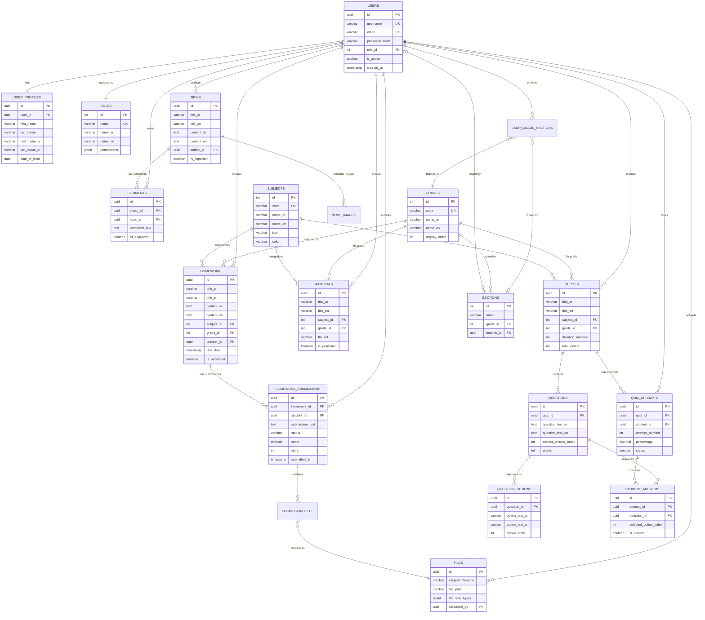

# Database Specification - Al-Manakhir School Platform

**Project**: School Educational Platform (مدرسة المناخر الأساسية)  
**Current State**: Mock JSON data (client-side)  
**Target**: PostgreSQL relational database

---

## Current Data Structure

The app currently uses JSON files in `/src/data/`:

- `homework.json` - Homework assignments
- `materials.json` - Educational materials
- `quizzes.json` - Quizzes with questions
- `news.json` - School announcements
- `grades.json` - Grade level mappings

Client-side storage (localforage/IndexedDB) for:

- Homework submissions
- Quiz attempts
- News comments

---

## Required Database Schema

### User Management

**users**

- id (UUID, PK)
- username, email (unique)
- password_hash
- role_id (FK → roles: student/teacher/admin)
- Standard timestamps

**user_profiles** (1:1 with users)

- Bilingual names (Arabic/English)
- DOB, phone, parent contact
- Profile picture URL

**user_grade_sections**

- Maps students to grade + section
- Academic year tracking
- `is_current` flag

---

### Academic Structure

**grades**: KG, 1-11, Tawjihi (bilingual labels)

**sections**: A, B, C, D per grade

**subjects**: Math, Science, Arabic, English, etc. (with icons/colors)

---

### Content Tables

**homework**

- Bilingual title/content
- subject_id, grade_id, section_id (nullable), teacher_id
- due_date, points
- allow_file_submission, allow_text_submission flags
- is_published, soft deletes

**homework_submissions**

- homework_id, student_id (unique together)
- submission_text
- status: draft/submitted/graded
- score, stars (1-5), feedback_text
- submitted_at, graded_at

**materials**

- Bilingual title/content/description
- subject_id, grade_id, teacher_id
- file_type, file_url, file_size_kb
- download_count, view_count

**quizzes**

- Bilingual title
- subject_id, grade_id, teacher_id
- quiz_date, duration_minutes, total_points
- max_attempts, shuffle_questions flags

**questions** (quiz questions)

- quiz_id
- Bilingual question text
- question_type: multiple_choice/true_false/short_answer
- correct_answer_index (for MC)
- points, display_order

**question_options** (for multiple choice)

- question_id
- Bilingual option text
- option_order

**quiz_attempts**

- quiz_id, student_id, attempt_number
- score, percentage, status
- started_at, submitted_at, time_taken_seconds

**student_answers**

- attempt_id, question_id
- selected_option_index or answer_text
- is_correct, points_earned

**news**

- Bilingual title/content
- category (bilingual)
- author_id, is_important, is_published
- published_at, view_count

**comments** (on news)

- news_id, user_id
- comment_text
- is_approved, parent_comment_id (for replies)

---

### File Management

**files**

- original_filename, stored_filename, file_path
- file_size_bytes, mime_type
- uploaded_by (FK → users)
- checksum, download_count

**submission_files** (links submissions to files)

- submission_id, file_id

---

## Key Requirements

### Multilingual Support

Almost all content has `_ar` and `_en` fields for Arabic/English

### RBAC

- Students: view own grade content, submit work
- Teachers: create/grade content
- Admins: full access

### Soft Deletes

Important tables use `deleted_at` timestamp instead of hard deletes

### Audit Trail

`created_at`, `updated_at`, `deleted_at` on most tables

### Indexing Needs

- Foreign keys
- grade_id + is_published (filtering)
- due dates, quiz dates
- User email/username (login)

---

## Sample Data Volumes (Initial)

- Users: ~500 students, ~30 teachers
- Grades: 13 fixed (KG through Tawjihi)
- Subjects: ~8 core subjects
- Homework: ~100 active assignments
- Materials: ~200 resources
- Quizzes: ~50 active
- News: ~20 articles

---

## Tech Stack Preferences

- **Database**: PostgreSQL 15+ (JSONB support needed)
- **Backend**: Node.js/Express or ASP.NET Core
- **ORM**: Prisma or Knex.js
- **Auth**: JWT-based
- **File Storage**: Local initially, S3/Azure Blob later

---

## Migration Notes

Need script to migrate from JSON → DB:

- Map JSON structure to relational schema
- Create default teacher users (content has no authors currently)
- Preserve homework/quiz IDs for continuity
- Migrate localforage data (submissions/attempts) per student

---

## Questions for Backend Developer

1. Preference for ORM vs raw SQL?
2. File upload strategy (local/cloud)?
3. Real-time features needed? (WebSocket for quiz timer?)
4. Backup/restore approach?
5. API design: REST or GraphQL?

---

## Current JSON Schema Examples

**Homework:**

```json
{
  "id": "hw-kg-1",
  "title": { "ar": "واجب التلوين", "en": "Coloring Homework" },
  "content": { "ar": "...", "en": "..." },
  "subject": { "ar": "فنون", "en": "Arts" },
  "grade": "KG",
  "dueDate": "2026-02-05T23:59:59Z",
  "allowFileSubmission": true,
  "allowTextSubmission": false
}
```

**Quiz:**

```json
{
  "id": "quiz-kg-1",
  "title": { "ar": "اختبار الأشكال", "en": "Shapes Quiz" },
  "subject": { "ar": "رياضيات", "en": "Mathematics" },
  "grade": "KG",
  "duration": 15,
  "totalPoints": 6,
  "questions": [
    {
      "id": "q1",
      "question": { "ar": "...", "en": "..." },
      "options": [
        { "ar": "2", "en": "2" },
        { "ar": "3", "en": "3" }
      ],
      "correctAnswer": 1,
      "points": 2
    }
  ]
}
```

---

## ER Diagram



---

**That's the complete spec.** Full schema SQL and migration scripts are available in `/database/` folder if needed.
